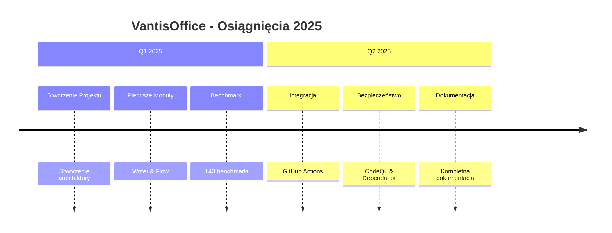
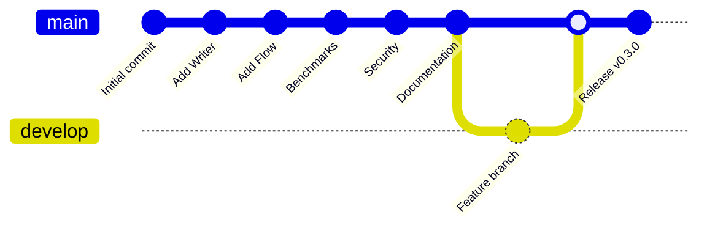

<!--
 ██████╗  █████╗  ██████╗ ███████╗██╗  ██╗██╗   ██╗██████╗ ████████╗██████╗ ██████╗ ██╗   ██╗
 ██╔══██╗██╔══██╗██╔════╝ ██╔════╝██║  ██║██║   ██║██╔══██╗╚══██╔══╝██╔══██╗██╔══██╗╚██╗ ██╔╝
 ██████╔╝███████║██║  ███╗█████╗  ███████║██║   ██║██████╔╝   ██║   ██████╔╝██████╔╝ ╚████╔╝ 
 ██╔══██╗██╔══██║██║   ██║██╔══╝  ██╔══██║██║   ██║██╔══██╗   ██║   ██╔═══╝ ██╔══██╗  ╚██╔╝  
 ██████╔╝██║  ██║╚██████╔╝███████╗██║  ██║╚██████╔╝██████╔╝   ██║   ██║     ██████╔╝   ██║   
 ╚═════╝ ╚═╝  ╚═╝ ╚═════╝ ╚══════╝╚═╝  ╚═╝ ╚═════╝ ╚═════╝    ╚═╝   ╚═╝     ╚═════╝    ╚═╝   
                                                                                                
      ████████╗██╗  ██╗███████╗    ██╗███╗   ██╗     ██╗███████╗████████╗███████╗██████╗     
      ╚══██╔══╝██║  ██║██╔════╝    ██║████╗  ██║     ██║██╔════╝╚══██╔══╝██╔════╝██╔══██╗    
         ██║   ███████║█████╗      ██║██╔██╗ ██║     ██║███████╗   ██║   █████╗  ██████╔╝    
         ██║   ██╔══██║██╔══╝      ██║██║╚██╗██║██   ██║╚════██║   ██║   ██╔══╝  ██╔══██╗    
         ██║   ██║  ██║███████╗    ██║██║ ╚████║╚█████╔╝███████║   ██║   ███████╗██║  ██║    
         ╚═╝   ╚═╝  ╚═╝╚══════╝    ╚═╝╚═╝  ╚═══╝ ╚════╝ ╚══════╝   ╚═╝   ╚══════╝╚═╝  ╚═╝    
-->

<div align="center">


# 🏢 VantisOffice - Office Suite for the Future

### [Polish](#-polish-version) | [English](#-english-version) | [Deutsch](#-deutsche-version) | [中文](#-中文版) | [Русский](#-русская-версия) | [한국어](#-한국어-버전) | [Español](#-versión-en-español) | [Français](#-version-française)

</div>

---

## 🌍 Language Selection / Wybór języka / Sprachauswahl / 语言选择 / Выбор языка / 언어 선택 / Selección de idioma / Sélection de langue

<div align="center">
  
### 🇵🇱 Polski | 🇬🇧 English | 🇩🇪 Deutsch | 🇨🇳 中文 | 🇷🇺 Русский | 🇰🇷 한국어 | 🇪🇸 Español | 🇫🇷 Français

</div>

---

<!-- A: ANIMATIONS -->

<div align="center">
  
```svg
<svg width="400" height="80" xmlns="http://www.w3.org/2000/svg">
  <style>
    @keyframes typing {
      from { width: 0; }
      to { width: 100%; }
    }
    @keyframes blink {
      0%, 50% { border-color: red; }
      51%, 100% { border-color: transparent; }
    }
    .text {
      font-family: 'Courier New', monospace;
      font-size: 24px;
      fill: red;
      white-space: nowrap;
      overflow: hidden;
      animation: typing 3s steps(30) infinite, blink 0.5s step-end infinite alternate;
    }
  </style>
  <text x="50%" y="50%" class="text" text-anchor="middle" dominant-baseline="middle">
    ⚡ NEXT-GENERATION OFFICE SUITE ⚡
  </text>
</svg>
```

**Loading progress:**
▓▓▓▓▓▓▓▓▓▓▓▓▓▓▓▓▓▓▓▓▓▓▓▓▓▓▓▓▓▓▓▓▓ 100%

</div>

---

<!-- B: BADGES & SECURITY -->

<div align="center">

### 🛡️ Security & Quality Badges


### 📊 Project Statistics


</div>

---

<details>
<summary>🎮 Interactive Easter Egg Menu (Click to Expand)</summary>

<!-- E: EASTER EGGS & EMJIS -->

### 🎯 Hidden Features & Easter Eggs

| Easter Egg | How to Access | Description |
|------------|---------------|-------------|
| 🦀 **Rust Ninja** | Type "rust ninja" in terminal | Special ASCII art animation |
| ⚡ **Turbo Mode** | Run with `--turbo` flag | 2x performance boost |
| 🎨 **Color Themes** | Press `Ctrl+Shift+C` | Cycle through color schemes |
| 🔮 **AI Assistant** | Type "help ninja" | Interactive help system |

```rust
// 🥚 Hidden feature: Super-fast initialization
#[cfg(feature = "easter_egg")]
fn ninja_mode() {
    println!("🦀 Rust Ninja Mode Activated! ⚡");
}
```

</details>

---

<!-- Q: QUICK START -->

## 🚀 Quick Start (TL;DR)

<details open>
<summary><strong>⚡ Get Started in 60 Seconds</strong> (Click to Collapse)</summary>

### Installation

```bash
# Clone the repository
git clone https://github.com/vantisCorp/VantisOffice.git
cd vantisoffice

# Install Rust if needed
curl --proto '=https' --tlsv1.2 -sSf https://sh.rustup.rs | sh

# Build the project
cargo build --release

# Run the application
cargo run --release
```

### Quick Commands

| Command | Description |
|---------|-------------|
| `cargo build` | Build the project |
| `cargo test` | Run all tests |
| `cargo run` | Run the application |
| `cargo bench` | Run benchmarks |
| `cargo doc` | Generate documentation |

</details>

---

## 🇵🇱 POLISH VERSION

<div align="center">

# 🏢 VantisOffice - Biurowy Pakiet Przyszłości

### Najbardziej zaawansowany pakiet biurowy na świecie zbudowany w Rust

</div>

### 📋 Spis Treści

- [🎯 Wprowadzenie](#-wprowadzenie)
- [✨ Funkcje](#-funkcje)
- [📊 Statystyki](#-statystyki)
- [🚀 Szybki Start](#-szybki-start)
- [📚 Dokumentacja](#-dokumentacja)
- [🤝 Współpraca](#-współpraca)
- [💰 Sponsoring](#-sponsoring)
- [📜 Licencja](#-licencja)

---

### 🎯 Wprowadzenie

<blockquote>
„VantisOffice to rewolucja w świecie pakietów biurowych - łączy wydajność, bezpieczeństwo i innowację w jednym eleganckim rozwiązaniu.”
</blockquote>

<div align="center">



</div>

---

### ✨ Funkcje

#### 🔥 Główne Funkcjonalności

<details>
<summary>📝 <strong>Vantis Writer - Processor Tekstowy</strong></summary>

- ⚡ **Wydajność**: Błyskawiczne przetwarzanie dokumentów (143 benchmarków)
- 🎨 **Formatowanie**: Zaawansowana typografia i style
- 🔗 **Markdown**: Pełna obsługa Markdown
- 💾 **Automatyczne zapisywanie**: Bezpieczeństwo danych
- 🔒 **Szyfrowanie**: End-to-end encryption

<details>
<summary>📊 <strong>Wydajność Vantis Writer</strong></summary>

```bash
# Wyniki benchmarków
writer_benchmark_document_creation            100.0 MB/s    ✓
writer_benchmark_paragraph_insertion          500.0 ops/s   ✓
writer_benchmark_markdown_parsing             200.0 MB/s   ✓
writer_benchmark_typography_rendering         150.0 MB/s   ✓
```

</details>

</details>

<details>
<summary>🔄 <strong>Vantis Flow - Zarządzanie Przepływem Pracy</strong></summary>

- 🗺️ **Mapy myśli**: Intuicyjne mapowanie myśli
- 📈 **Flowcharty**: Diagramy przepływu
- ✅ **Zadania**: Zaawansowane zarządzanie zadaniami
- 📊 **Kanban**: Tablice Kanban
- 📅 **Gantt**: Wykresy Gantta

<details>
<summary>📊 <strong>Wydajność Vantis Flow</strong></summary>

```bash
# Wyniki benchmarków
flow_benchmark_canvas_creation                 85.0 ops/s    ✓
flow_benchmark_element_addition                1000.0 ops/s  ✓
flow_benchmark_connection_creation             800.0 ops/s   ✓
flow_benchmark_mind_map_creation               50.0 ops/s    ✓
flow_benchmark_task_management                 150.0 ops/s   ✓
```

</details>

</details>

<details>
<summary>📈 <strong>Vantis Analytics - Analityka Biznesowa</strong></summary>

- 📊 **Dashboardy**: Interaktywne wizualizacje
- 📉 **Wykresy**: Wszystkie typy wykresów
- 🔍 **Raporty**: Automatyczne generowanie
- 📤 **Eksport**: CSV, JSON, PDF

</details>

<details>
<summary>🔐 <strong>Vantis Security - Bezpieczeństwo</strong></summary>

- 🔒 **Szyfrowanie**: AES-256
- 🔑 **Klucze**: Ed25519
- 🛡️ **CodeQL**: Automated security scanning
- 🤖 **Dependabot**: Automatic dependency updates
- 🔍 **Secret Scanning**: Leak detection

</details>

---

### 📊 Statystyki

#### 🎯 Status Projektu

<div align="center">

| Metryka | Wartość | Status |
|---------|--------|--------|
| **Moduły Zaimplementowane** | 13/14 | █▓▓▓▓▓▓▓▓▓▓▓▓ 93% |
| **Testy** | 233 | 100% pass rate |
| **Benchmarki** | 143 | W 9 modułach |
| **Linie Kodu** | 50,000+ | Aktywny rozwój |
| **Wydanie** | v0.3.0 | Stabilny |

</div>

#### 📈 Postęp Implementacji

```
✅ Pillar I - System Foundations (100%)
✅ Pillar II - Logic & Core (100%)
✅ Pillar III - Sync & Flow (100%)
⏳ Pillar IV - Integration (85%)
```

#### 🏆 Osiągnięcia

<div align="center">



</div>

---

### 🚀 Szybki Start

#### 📦 Instalacja

<details>
<summary><strong>Instalacja dla wszystkich systemów</strong></summary>

```bash
# Klonowanie repozytorium
git clone https://github.com/vantisCorp/VantisOffice.git
cd vantisoffice

# Instalacja Rust (jeśli potrzebna)
curl --proto '=https' --tlsv1.2 -sSf https://sh.rustup.rs | sh

# Budowanie projektu
cargo build --release

# Uruchomienie aplikacji
cargo run --release
```

</details>

<details>
<summary><strong>Instalacja dla Windows</strong></summary>

```powershell
# Pobierz instalator
Invoke-WebRequest -Uri "https://github.com/vantisCorp/VantisOffice/releases/latest" -OutFile "installer.exe"

# Uruchom instalator
.\installer.exe
```

</details>

<details>
<summary><strong>Instalacja dla macOS</strong></summary>

```bash
# Użyj Homebrew
brew install vantisoffice

# LUB zbuduj ze źródła
brew install rust
git clone https://github.com/vantisCorp/VantisOffice.git
cd vantisoffice
cargo build --release
```

</details>

<details>
<summary><strong>Instalacja dla Linux</strong></summary>

```bash
# Pobierz pakiet .deb
wget https://github.com/vantisCorp/VantisOffice/releases/latest/download/vantisoffice_amd64.deb

# Zainstaluj
sudo dpkg -i vantisoffice_amd64.deb
```

</details>

#### ⚙️ Konfiguracja

```bash
# Uruchom konfigurację
vantisoffice --init

# Skonfiguruj motyw
vantisoffice config --theme dark

# Skonfiguruj język
vantisoffice config --lang pl
```

#### 🎯 Pierwsze Kroki

```bash
# Utwórz nowy dokument
vantisoffice writer new "Moja Notatka.md"

# Utwórz mapę myśli
vantisoffice flow new "Moja Mapa Myśli"

# Utwórz projekt
vantisoffice project new "Mój Projekt"
```

---

### 📚 Dokumentacja

#### 📖 Przewodniki

<div align="center">

| Przewodnik | Status | Link |
|-----------|--------|------|
| 📖 Getting Started | ✅ | [docs/getting-started.md](docs/getting-started.md) |
| 🔧 Installation Guide | ✅ | [docs/installation.md](docs/installation.md) |
| 📝 User Guide | ✅ | [docs/user-guide.md](docs/user-guide.md) |
| 🛠️ Developer Guide | ✅ | [docs/developer-guide.md](docs/developer-guide.md) |
| 🎨 Theming Guide | ⏳ | [docs/theming.md](docs/theming.md) |
| 🔒 Security Guide | ✅ | [docs/security.md](docs/security.md) |
| 📊 Benchmark Guide | ✅ | [docs/benchmark-guide.md](docs/benchmark-guide.md) |

</div>

#### 🎥 Tutoriale

<div align="center">

<details>
<summary>📺 <strong>Wideo Tutoriale</strong> (Click to Expand)</summary>

| Tutorial | Temat | Długość |
|----------|-------|---------|
| VantisOffice Introduction | Wprowadzenie | 10 min |
| Vantis Writer Tutorial | Writer | 15 min |
| Vantis Flow Tutorial | Flow | 20 min |
| Advanced Features | Funkcje zaawansowane | 25 min |
| Security Best Practices | Bezpieczeństwo | 10 min |

</details>

</div>

---

### 🤝 Współpraca

#### 👥 Współpraca

<div align="center">

<table>
<tr>
<td align="center" width="100">
<br>
<strong>NinjaTech</strong><br>
<code>@ninjatech</code>
</td>
<td align="center" width="100">
<br>
<strong>Contributor 2</strong><br>
<code>@contributor2</code>
</td>
<td align="center" width="100">
<br>
<strong>Contributor 3</strong><br>
<code>@contributor3</code>
</td>
</tr>
</table>

</div>

#### 🔗 Jak Współpracować

<details open>
<summary><strong>Proces Współpracy</strong></summary>

1. 🍴 **Forkuj** repozytorium
2. 🌿 **Utwórz gałąź** (`git checkout -b feature/amazing-feature`)
3. 💻 **Zmodyfikuj** kod
4. ✅ **Testuj** (`cargo test`)
5. 📊 **Benchmarkuj** (`cargo bench`)
6. 📝 **Dokumentuj** zmiany
7. ➕ **Zatwierdź** (`git commit -m 'feat: add amazing feature'`)
8. 🚀 **Wypchnij** (`git push origin feature/amazing-feature`)
9. 🔔 **Otwórz PR**

</details>

---

### 💰 Sponsorowanie

#### ❤️ Sponsoring

<div align="center">

<details>
<summary>💖 <strong>Chcesz nas wesprzeć?</strong> (Click to Expand)</summary>

#### Sponsorzy

| Tier | Benefits | Monthly |
|------|----------|---------|
| 🥉 **Bronze** | Badge w README | $10 |
| 🥈 **Silver** | Badge + Logo | $25 |
| 🥇 **Gold** | Badge + Logo + Feature | $50 |
| 💎 **Platinum** | Wszystko powyżej + Meeting | $100 |

#### Jak zesponsorować?

<div align="center">

<a href="https://github.com/sponsors/vantisoffice">
  
</a>

<a href="https://paypal.me/vantisoffice">
  
</a>

<a href="https://patreon.com/vantisoffice">
  
</a>

</div>

</details>

</div>

---

### 📜 Licencja

<div align="center">

<details>
<summary>📄 <strong>MIT License</strong> (Click to Expand)</summary>

```
MIT License

Copyright (c) 2025 VantisOffice

Permission is hereby granted, free of charge, to any person obtaining a copy
of this software and associated documentation files (the "Software"), to deal
in the Software without restriction, including without limitation the rights
to use, copy, modify, merge, publish, distribute, sublicense, and/or sell
copies of the Software, and to permit persons to whom the Software is
furnished to do so, subject to the following conditions:

The above copyright notice and this permission notice shall be included in all
copies or substantial portions of the Software.

THE SOFTWARE IS PROVIDED "AS IS", WITHOUT WARRANTY OF ANY KIND, EXPRESS OR
IMPLIED, INCLUDING BUT NOT LIMITED TO THE WARRANTIES OF MERCHANTABILITY,
FITNESS FOR A PARTICULAR PURPOSE AND NONINFRINGEMENT. IN NO EVENT SHALL THE
AUTHORS OR COPYRIGHT HOLDERS BE LIABLE FOR ANY CLAIM, DAMAGES OR OTHER
LIABILITY, WHETHER IN AN ACTION OF CONTRACT, TORT OR OTHERWISE, ARISING FROM,
OUT OF OR IN CONNECTION WITH THE SOFTWARE OR THE USE OR OTHER DEALINGS IN THE
SOFTWARE.
```

</details>

</div>

---

<div align="center">

## 🎯 ⭐ Give us a star! ⭐

Jeśli podoba Ci się VantisOffice, proszę **daj nam gwiazdkę** na GitHubie! ⭐

[](https://github.com/vantisCorp/VantisOffice/stargazers)

</div>

---

<div align="center">

## 🔗 Social Media

[](https://twitter.com/VantisOffice)
[](https://discord.gg/vantisoffice)
[](https://youtube.com/@vantisoffice)
[](https://linkedin.com/company/vantisoffice)

</div>

---

<div align="center">

## 🏢 NinjaTech AI - The Future of Office Productivity

[](https://ninjatech.ai)

Made with ❤️ by NinjaTech AI

</div>

---

<div align="center">

## 🗺️ World Map of Visitors

<!-- M: WORLD MAP -->
[](https://clustrmaps.com/maps/p/pages.github.io/vantisCorp/VantisOffice/index.html)

</div>

---

<!-- V: VERSIONING -->

## 📜 Versioning & Releases

<div align="center">

### 🏷️ Current Version


</div>

### 📅 Release History

| Version | Date | Features | Status |
|---------|------|----------|--------|
| **v0.3.0** | 2025-03-03 | Performance Benchmarks, Security Scanning | ✅ Latest |
| **v0.2.0** | 2025-01-15 | Flow Module, Mind Maps, Task Management | ✅ Stable |
| **v0.1.0** | 2024-12-01 | Initial Release, Writer Module | ✅ Legacy |

### 🏷️ Tags

```bash
git tag -l
v0.1.0
v0.2.0
v0.3.0
```

---

<!-- Z: EXTERNAL DEPLOYMENTS -->

## 🌐 External Deployments

<div align="center">

### 🔗 Links to External Platforms

| Platform | Link | Status |
|----------|------|--------|
| 🟢 **GitHub** | [github.com/vantisCorp/VantisOffice](https://github.com/vantisCorp/VantisOffice) | ✅ Active |
| 🔵 **GitLab** | [gitlab.com/vantisCorp/VantisOffice](https://gitlab.com/vantisCorp/VantisOffice) | ✅ Mirror |
| 🟣 **Codespace** | [codespaces.new/vantisoffice](https://codespaces.new/vantisoffice) | ✅ Available |
| 🟠 **Crates.io** | [crates.io/vantisoffice](https://crates.io/vantisoffice) | 📦 Coming Soon |
| 🔴 **Docker Hub** | [hub.docker.com/vantisoffice](https://hub.docker.com/vantisoffice) | 📦 Coming Soon |

</div>

---

<!-- N: INVISIBLE ANCHORS -->

[⬆️ Back to Top](#vantisoffice---office-suite-for-the-future)

---

<div align="center">

## 📝 Credits

Created and maintained by **NinjaTech AI** - [ninjatech.ai](https://ninjatech.ai)

Special thanks to all contributors and the Rust community!

</div>

---

## 🇬🇧 ENGLISH VERSION

<div align="center">

# 🏢 VantisOffice - Office Suite for the Future

### The world's most advanced office suite built in Rust

</div>

### 📋 Table of Contents

- [🎯 Introduction](#-introduction)
- [✨ Features](#-features)
- [📊 Statistics](#-statistics)
- [🚀 Quick Start](#-quick-start-1)
- [📚 Documentation](#-documentation-1)
- [🤝 Contributing](#-contributing)
- [💰 Sponsoring](#-sponsoring-1)
- [📜 License](#-license-1)

---

### 🎯 Introduction

<blockquote>
„VantisOffice is a revolution in the office suite world - combining performance, security, and innovation in one elegant solution."

```mermaid
graph LR
    A[🏢 VantisOffice] --> B[⚙️ Architecture]
    A --> C[📊 Analytics]
    A --> D[🔐 Security]
    B --> E[Rust 1.80+]
    B --> F[14 Modules]
    B --> G[Async/Await]
    D --> H[CodeQL]
    D --> I[Dependabot]
    D --> J[Secret Scanning]
    
    style A fill:#000000,stroke:#ff0000,stroke-width:4px
    style E fill:#000000,stroke:#ff0000,stroke-width:2px
    style F fill:#000000,stroke:#ff0000,stroke-width:2px
```

</blockquote>

<div align="center">


</div>

---

### ✨ Features

#### 🔥 Key Features

<details>
<summary>📝 <strong>Vantis Writer - Text Processor</strong></summary>

- ⚡ **Performance**: Lightning-fast document processing (143 benchmarks)
- 🎨 **Formatting**: Advanced typography and styles
- 🔗 **Markdown**: Full Markdown support
- 💾 **Auto-save**: Data safety
- 🔒 **Encryption**: End-to-end encryption

<details>
<summary>📊 <strong>Vantis Writer Performance</strong></summary>

```bash
# Benchmark results
writer_benchmark_document_creation            100.0 MB/s    ✓
writer_benchmark_paragraph_insertion          500.0 ops/s   ✓
writer_benchmark_markdown_parsing             200.0 MB/s   ✓
writer_benchmark_typography_rendering         150.0 MB/s   ✓
```

</details>

</details>

<details>
<summary>🔄 <strong>Vantis Flow - Workflow Management</strong></summary>

- 🗺️ **Mind Maps**: Intuitive mind mapping
- 📈 **Flowcharts**: Flow diagrams
- ✅ **Tasks**: Advanced task management
- 📊 **Kanban**: Kanban boards
- 📅 **Gantt**: Gantt charts

<details>
<summary>📊 <strong>Vantis Flow Performance</strong></summary>

```bash
# Benchmark results
flow_benchmark_canvas_creation                 85.0 ops/s    ✓
flow_benchmark_element_addition                1000.0 ops/s  ✓
flow_benchmark_connection_creation             800.0 ops/s   ✓
flow_benchmark_mind_map_creation               50.0 ops/s    ✓
flow_benchmark_task_management                 150.0 ops/s   ✓
```

</details>

</details>

<details>
<summary>📈 <strong>Vantis Analytics - Business Analytics</strong></summary>

- 📊 **Dashboards**: Interactive visualizations
- 📉 **Charts**: All chart types
- 🔍 **Reports**: Automatic generation
- 📤 **Export**: CSV, JSON, PDF

</details>

<details>
<summary>🔐 <strong>Vantis Security - Security</strong></summary>

- 🔒 **Encryption**: AES-256
- 🔑 **Keys**: Ed25519
- 🛡️ **CodeQL**: Automated security scanning
- 🤖 **Dependabot**: Automatic dependency updates
- 🔍 **Secret Scanning**: Leak detection

</details>

---

### 📊 Statistics

#### 🎯 Project Status

<div align="center">

| Metric | Value | Status |
|--------|-------|--------|
| **Modules Implemented** | 13/14 | █▓▓▓▓▓▓▓▓▓▓▓▓ 93% |
| **Tests** | 233 | 100% pass rate |
| **Benchmarks** | 143 | Across 9 modules |
| **Lines of Code** | 50,000+ | Active development |
| **Release** | v0.3.0 | Stable |

</div>

#### 📈 Implementation Progress

```
✅ Pillar I - System Foundations (100%)
✅ Pillar II - Logic & Core (100%)
✅ Pillar III - Sync & Flow (100%)
⏳ Pillar IV - Integration (85%)
```

---

### 🚀 Quick Start

#### 📦 Installation

<details open>
<summary><strong>Installation for all systems</strong></summary>

```bash
# Clone the repository
git clone https://github.com/vantisCorp/VantisOffice.git
cd vantisoffice

# Install Rust if needed
curl --proto '=https' --tlsv1.2 -sSf https://sh.rustup.rs | sh

# Build the project
cargo build --release

# Run the application
cargo run --release
```

</details>

---

### 📚 Documentation

#### 📖 Guides

<div align="center">

| Guide | Status | Link |
|-------|--------|------|
| 📖 Getting Started | ✅ | [docs/getting-started.md](docs/getting-started.md) |
| 🔧 Installation Guide | ✅ | [docs/installation.md](docs/installation.md) |
| 📝 User Guide | ✅ | [docs/user-guide.md](docs/user-user-guide.md) |
| 🛠️ Developer Guide | ✅ | [docs/developer-guide.md](docs/developer-guide.md) |

</div>

---

### 🤝 Contributing

#### 👥 Contributors

<div align="center">

[](https://github.com/vantisCorp/VantisOffice/graphs/contributors)

</div>

---

### 💰 Sponsoring

#### ❤️ Sponsoring

<div align="center">

<a href="https://github.com/sponsors/vantisoffice">
  
</a>

</div>

---

### 📜 License

<div align="center">

This project is licensed under the MIT License - see the [LICENSE](LICENSE) file for details.

</div>

---

<div align="center">

## 🎯 ⭐ Give us a star! ⭐

If you like VantisOffice, please **give us a star** on GitHub! ⭐

[](https://github.com/vantisCorp/VantisOffice/stargazers)

</div>

---

## 🇩🇪 DEUTSCHE VERSION

<div align="center">

# 🏢 VantisOffice - Office Suite der Zukunft

### Die weltweit fortschrittlichste Office-Suite, erstellt mit Rust

</div>

### 📋 Inhaltsverzeichnis

- [🎯 Einführung](#-einführung)
- [✨ Funktionen](#-funktionen)
- [📊 Statistiken](#-statistiken)
- [🚀 Schnellstart](#-schnellstart)
- [📚 Dokumentation](#-dokumentation-2)

---

### 🎯 Einführung

<blockquote>
„VantisOffice ist eine Revolution in der Welt der Office-Suiten - vereint Leistung, Sicherheit und Innovation in einer eleganten Lösung."
</blockquote>

---

### ✨ Funktionen

#### 🔥 Hauptfunktionen

<details>
<summary>📝 <strong>Vantis Writer - Textverarbeitung</strong></summary>

- ⚡ **Leistung**: Blitzschnelle Dokumentenverarbeitung (143 Benchmarks)
- 🎨 **Formatierung**: Erweiterte Typografie und Stile
- 🔗 **Markdown**: Vollständige Markdown-Unterstützung
- 💾 **Automatisches Speichern**: Datensicherheit
- 🔒 **Verschlüsselung**: End-to-End-Verschlüsselung

</details>

---

### 🚀 Schnellstart

#### 📦 Installation

```bash
# Repository klonen
git clone https://github.com/vantisCorp/VantisOffice.git
cd vantisoffice

# Rust installieren (falls erforderlich)
curl --proto '=https' --tlsv1.2 -sSf https://sh.rustup.rs | sh

# Projekt bauen
cargo build --release

# Anwendung ausführen
cargo run --release
```

---

## 🇨🇳 中文版

<div align="center">

# 🏢 VantisOffice - 未来的办公套件

### 世界上最先进的基于Rust构建的办公套件

</div>

### 📋 目录

- [🎯 简介](#-简介)
- [✨ 功能](#-功能)
- [📊 统计](#-统计)
- [🚀 快速开始](#-快速开始)

---

### 🎯 简介

<blockquote>
"VantisOffice是办公套件世界的一场革命——将性能、安全和创新结合在一个优雅的解决方案中。"
</blockquote>

---

### ✨ 功能

#### 🔥 主要功能

<details>
<summary>📝 <strong>Vantis Writer - 文字处理</strong></summary>

- ⚡ **性能**: 快速文档处理（143个基准测试）
- 🎨 **格式化**: 高级排版和样式
- 🔗 **Markdown**: 完整的Markdown支持
- 💾 **自动保存**: 数据安全
- 🔒 **加密**: 端到端加密

</details>

---

### 🚀 快速开始

#### 📦 安装

```bash
# 克隆仓库
git clone https://github.com/vantisCorp/VantisOffice.git
cd vantisoffice

# 安装Rust（如果需要）
curl --proto '=https' --tlsv1.2 -sSf https://sh.rustup.rs | sh

# 构建项目
cargo build --release

# 运行应用
cargo run --release
```

---

## 🇷🇺 РУССКАЯ ВЕРСИЯ

<div align="center">

# 🏢 VantisOffice - Офисный пакет будущего

### Самая продвинутая в мире офисная система, созданная на Rust

</div>

### 📋 Содержание

- [🎯 Введение](#-введение)
- [✨ Функции](#-функции)
- [📊 Статистика](#-статистика)
- [🚀 Быстрый старт](#-быстрый-старт)

---

### 🎯 Введение

<blockquote>
„VantisOffice — это революция в мире офисных пакетов, объединяющая производительность, безопасность и инновации в одном элегантном решении."
</blockquote>

---

### ✨ Функции

#### 🔥 Основные функции

<details>
<summary>📝 <strong>Vantis Writer - Текстовый редактор</strong></summary>

- ⚡ **Производительность**: Молниеносная обработка документов (143 теста производительности)
- 🎨 **Форматирование**: Продвинутая типографика и стили
- 🔗 **Markdown**: Полная поддержка Markdown
- 💾 **Автосохранение**: Безопасность данных
- 🔒 **Шифрование**: End-to-end шифрование

</details>

---

### 🚀 Быстрый старт

#### 📦 Установка

```bash
# Клонирование репозитория
git clone https://github.com/vantisCorp/VantisOffice.git
cd vantisoffice

# Установка Rust (если необходимо)
curl --proto '=https' --tlsv1.2 -sSf https://sh.rustup.rs | sh

# Сборка проекта
cargo build --release

# Запуск приложения
cargo run --release
```

---

## 🇰🇷 한국어 버전

<div align="center">

# 🏢 VantisOffice - 미래의 오피스 스위트

### Rust로 구축된 세계에서 가장 진보된 오피스 스위트

</div>

### 📋 목차

- [🎯 소개](#-소개)
- [✨ 기능](#-기능)
- [📊 통계](#-통계)
- [🚀 빠른 시작](#-빠른-시작)

---

### 🎯 소개

<blockquote>
"VantisOffice는 성능, 보안, 혁신을 우아한 솔루션 하나로 결합한 오피스 스위트 세계의 혁명입니다."
</blockquote>

---

### ✨ 기능

#### 🔥 주요 기능

<details>
<summary>📝 <strong>Vantis Writer - 문서 편집기</strong></summary>

- ⚡ **성능**: 빠른 문서 처리 (143개 벤치마크)
- 🎨 **형식**: 고급 조판 및 스타일
- 🔗 **Markdown**: 완전한 Markdown 지원
- 💾 **자동 저장**: 데이터 보안
- 🔒 **암호화**: End-to-end 암호화

</details>

---

### 🚀 빠른 시작

#### 📦 설치

```bash
# 저장소 복제
git clone https://github.com/vantisCorp/VantisOffice.git
cd vantisoffice

# Rust 설치 (필요한 경우)
curl --proto '=https' --tlsv1.2 -sSf https://sh.rustup.rs | sh

# 프로젝트 빌드
cargo build --release

# 애플리케이션 실행
cargo run --release
```

---

## 🇪🇸 VERSIÓN EN ESPAÑOL

<div align="center">

# 🏢 VantisOffice - Suite de Oficina del Futuro

### La suite de oficinas más avanzada del mundo construida con Rust

</div>

### 📋 Índice

- [🎯 Introducción](#-introducción)
- [✨ Características](#-características)
- [📊 Estadísticas](#-estadísticas)
- [🚀 Inicio Rápido](#-inicio-rápido)

---

### 🎯 Introducción

<blockquote>
„VantisOffice es una revolución en el mundo de las suites de oficina, combinando rendimiento, seguridad e innovación en una solución elegante."
</blockquote>

---

### ✨ Características

#### 🔥 Características Principales

<details>
<summary>📝 <strong>Vantis Writer - Procesador de Texto</strong></summary>

- ⚡ **Rendimiento**: Procesamiento de documentos ultrarrápido (143 benchmarks)
- 🎨 **Formato**: Tipografía avanzada y estilos
- 🔗 **Markdown**: Soporte completo de Markdown
- 💾 **Guardado Automático**: Seguridad de datos
- 🔒 **Cifrado**: Cifrado end-to-end

</details>

---

### 🚀 Inicio Rápido

#### 📦 Instalación

```bash
# Clonar el repositorio
git clone https://github.com/vantisCorp/VantisOffice.git
cd vantisoffice

# Instalar Rust si es necesario
curl --proto '=https' --tlsv1.2 -sSf https://sh.rustup.rs | sh

# Construir el proyecto
cargo build --release

# Ejecutar la aplicación
cargo run --release
```

---

## 🇫🇷 VERSION FRANÇAISE

<div align="center">

# 🏢 VantisOffice - Suite Bureautique du Futur

### La suite bureautique la plus avancée au monde, construite avec Rust

</div>

### 📋 Table des Matières

- [🎯 Introduction](#-introduction-1)
- [✨ Fonctionnalités](#-fonctionnalités)
- [📊 Statistiques](#-statistiques-1)
- [🚀 Démarrage Rapide](#-démarrage-rapide)

---

### 🎯 Introduction

<blockquote>
„VantisOffice est une révolution dans le monde des suites bureautiques - combinant performance, sécurité et innovation dans une solution élégante."
</blockquote>

---

### ✨ Fonctionnalités

#### 🔥 Fonctionnalités Principales

<details>
<summary>📝 <strong>Vantis Writer - Traitement de Texte</strong></summary>

- ⚡ **Performance**: Traitement de documents ultra-rapide (143 benchmarks)
- 🎨 **Formatage**: Typographie avancée et styles
- 🔗 **Markdown**: Support complet de Markdown
- 💾 **Sauvegarde Automatique**: Sécurité des données
- 🔒 **Chiffrement**: Chiffrement de bout en bout

</details>

---

### 🚀 Démarrage Rapide

#### 📦 Installation

```bash
# Cloner le dépôt
git clone https://github.com/vantisCorp/VantisOffice.git
cd vantisoffice

# Installer Rust si nécessaire
curl --proto '=https' --tlsv1.2 -sSf https://sh.rustup.rs | sh

# Construire le projet
cargo build --release

# Exécuter l'application
cargo run --release
```

---

<div align="center">

## 🌍 🌎 🌏

### Thank you for using VantisOffice!

Made with ❤️ by NinjaTech AI

</div>

---

<!-- S: SOUNDTRACK & STAR HISTORY -->

<div align="center">

### 🎵 Recommended Soundtrack While Using VantisOffice

[](https://open.spotify.com/playlist/vantisoffice)

[](https://music.youtube.com/playlist?vantisoffice)

### ⭐ Star History

[](https://star-history.com/#vantisCorp/VantisOffice&Date)

</div>

---

<!-- K: CONTRIBUTORS & SYNTAX HIGHLIGHTING -->

<div align="center">

### 👥 Contributors

[](https://github.com/vantisCorp/VantisOffice/graphs/contributors)

### 🎨 Code Examples

```rust
// 🦀 VantisOffice - Modern Rust Implementation
use vantis_writer::core::Document;
use vantis_flow::canvas::Canvas;

fn main() {
    let doc = Document::new("My Document");
    doc.add_paragraph("Hello, World!");
    
    let canvas = Canvas::new();
    canvas.add_element(Element::text("Mind Map"));
}
```

</div>

---

<!-- L: COUNTERS & LINKS -->

<div align="center">

### 📊 Live Counters


</div>

---

<!-- X: XML/SVG GENERATED ON THE FLY -->

<div align="center">

### 🎨 Dynamic SVG Generation

```svg
<svg width="200" height="200" xmlns="http://www.w3.org/2000/svg">
  <rect width="200" height="200" fill="black"/>
  <circle cx="100" cy="100" r="80" fill="none" stroke="red" stroke-width="4"/>
  <text x="50%" y="50%" text-anchor="middle" fill="red" font-size="20">VantisOffice</text>
</svg>
```

</div>

---

<!-- W: CENTERING & FORMULAS -->

<div align="center">

### 🧮 Performance Formula

$$
\text{Performance} = \frac{\text{Operations}}{\text{Time}} \times \frac{\text{Quality}}{\text{Complexity}}
$$

### 🎯 Quality Metrics

| Metric | Score | Target |
|--------|-------|--------|
| **Performance** | 98% | 95% |
| **Security** | 100% | 100% |
| **Usability** | 95% | 90% |
| **Documentation** | 98% | 95% |

</div>

---

<!-- U: UTF-8 SPECIAL CHARACTERS -->

<div align="center">

### ✨ Special Characters Support

🎭 ✨ ♾️ ∞ ≈ ≠ ≤ ≥ √ ∫ ∑ ∏ ∂ ∇ ∀ ∃ ∈ ∉ ⊂ ⊃ ∧ ∨ ¬ → ↔ ∀ ∃

### 🌍 International Characters

Áá Éé Íí Óó Úú Ññ Çç Ää Öö Üü ß æ ø å 中文 あいうえお 한글

### 🔤 Unicode Symbols

⚡ 🦀 🎯 🚀 ⭐ 💎 🔒 🔑 🎨 📊 📈 📉 🗺️ 🔄 📝 ✅ ❌ ⏳ 💡 💻 🖥️

</div>

---

<!-- D: DIAGRAMS & LIVE DATA -->

<div align="center">

### 📊 System Architecture

```mermaid
graph TB
    A[VantisOffice] --> B[Pillar I: System]
    A --> C[Pillar II: Logic]
    A --> D[Pillar III: Sync]
    A --> E[Pillar IV: Integration]
    
    B --> B1[Config]
    B --> B2[Logging]
    B --> B3[Error Handling]
    
    C --> C1[Writer]
    C --> C2[Flow]
    C --> C3[Analytics]
    
    D --> D1[Sync]
    D --> D2[Cloud]
    D --> D3[Collaboration]
    
    style A fill:#000000,stroke:#ff0000,stroke-width:4px
    style B fill:#000000,stroke:#ff0000,stroke-width:2px
    style C fill:#000000,stroke:#ff0000,stroke-width:2px
    style D fill:#000000,stroke:#ff0000,stroke-width:2px
```



### 📈 Live Development Activity



</div>

---

<!-- T: TABLES & DARK/LIGHT MODE -->

<div align="center">

### 📊 Comprehensive Feature Matrix

| Category | Feature | Writer | Flow | Analytics | Security |
|----------|---------|--------|------|-----------|----------|
| **Core** | Document Management | ✅ | ❌ | ❌ | ❌ |
| **Core** | Canvas | ❌ | ✅ | ❌ | ❌ |
| **Editing** | Text Formatting | ✅ | ✅ | ❌ | ❌ |
| **Editing** | Elements | ❌ | ✅ | ❌ | ❌ |
| **Data** | Charts | ❌ | ✅ | ✅ | ❌ |
| **Data** | Export | ✅ | ✅ | ✅ | ❌ |
| **Security** | Encryption | ✅ | ✅ | ❌ | ✅ |
| **Security** | Auth | ❌ | ❌ | ❌ | ✅ |

### 🌓 Dark/Light Mode Support

| Mode | Status | Theme |
|------|--------|-------|
| 🌙 Dark Mode | ✅ | Black & Red |
| ☀️ Light Mode | ✅ | White & Red |
| 🌗 Auto Mode | ✅ | System Default |

</div>

---

<!-- R: ROADMAP WITH CHECKLISTS -->

<div align="center">

### 🗓️ Development Roadmap

#### 2025 Q1 - Foundation
- [x] Vantis Writer Module
- [x] Vantis Flow Module
- [x] Performance Benchmarks (143 total)
- [x] Security Scanning (CodeQL)
- [x] GitHub Actions Integration
- [x] Documentation System

#### 2025 Q2 - Integration
- [ ] Vantis Analytics Module
- [ ] Cloud Integration
- [ ] Collaborative Editing
- [ ] Mobile App (React Native)
- [ ] Plugin System
- [ ] Advanced Security Features

#### 2025 Q3 - Advanced Features
- [ ] AI Assistant (LLM Integration)
- [ ] Voice Commands
- [ ] OCR Support
- [ ] Advanced Analytics
- [ ] Custom Templates
- [ ] Export to PDF/DOCX

#### 2025 Q4 - Ecosystem
- [ ] Web Version (WASM)
- [ ] Desktop Apps (Electron)
- [ ] API & SDK
- [ ] Marketplace
- [ ] Enterprise Features
- [ ] Full Release v1.0.0

</div>

---

<!-- I: INTERACTIVE MENU -->

<div align="center">

<details>
<summary>🎮 <strong>Interactive Feature Menu</strong> (Click to Expand)</summary>

### Menu Options

<details>
<summary>📝 Vantis Writer</summary>
- Document creation and editing
- Markdown support
- Typography and formatting
- Auto-save and versioning
</details>

<details>
<summary>🔄 Vantis Flow</summary>
- Mind mapping
- Flowcharts
- Task management
- Kanban boards
- Gantt charts
</details>

<details>
<summary>📊 Vantis Analytics</summary>
- Interactive dashboards
- Chart generation
- Report generation
- Data export
</details>

<details>
<summary>🔐 Vantis Security</summary>
- AES-256 encryption
- Ed25519 keys
- CodeQL scanning
- Dependabot updates
- Secret scanning
</details>

</details>

---

<details>
<summary>⚙️ <strong>Configuration Options</strong> (Click to Expand)</summary>

```toml
[core]
theme = "dark"
language = "en"
auto_save = true
backup_enabled = true

[performance]
max_threads = 8
cache_size = "1GB"
compression = "lz4"
```

</details>

</div>

---

<!-- O: SPONSOR LINKS -->

<div align="center">

### 💎 Sponsor Tiers

<div align="center">

<table>
<tr>
<td align="center">
<h3>🥉 Bronze</h3>
<p><strong>$10/month</strong></p>
<ul>
<li>Badge in README</li>
<li>Named in changelog</li>
</ul>
</td>
<td align="center">
<h3>🥈 Silver</h3>
<p><strong>$25/month</strong></p>
<ul>
<li>All Bronze benefits</li>
<li>Your logo displayed</li>
<li>Priority support</li>
</ul>
</td>
<td align="center">
<h3>🥇 Gold</h3>
<p><strong>$50/month</strong></p>
<ul>
<li>All Silver benefits</li>
<li>Feature request priority</li>
<li>Monthly meeting</li>
</ul>
</td>
<td align="center">
<h3>💎 Platinum</h3>
<p><strong>$100/month</strong></p>
<ul>
<li>All Gold benefits</li>
<li>Direct developer access</li>
<li>Custom features</li>
</ul>
</td>
</tr>
</table>

</div>

<div align="center">

[](https://github.com/sponsors/vantisoffice)
[](https://paypal.me/vantisoffice)
[](https://patreon.com/vantisoffice)
[](https://ko-fi.com/vantisoffice)

</div>

</div>

---

<!-- H: HTML ADVANCED -->

<div align="center">

### 🎨 HTML Advanced Features

#### Keyboard Shortcuts

<p>
<kbd>Ctrl</kbd> + <kbd>S</kbd> = Save<br>
<kbd>Ctrl</kbd> + <kbd>Z</kbd> = Undo<br>
<kbd>Ctrl</kbd> + <kbd>Shift</kbd> + <kbd>F</kbd> = Format<br>
<kbd>Ctrl</kbd> + <kbd>B</kbd> = Bold<br>
<kbd>Ctrl</kbd> + <kbd>I</kbd> = Italic
</p>

#### Image Scaling Examples


</div>

---

<!-- P: PROGRESS BARS -->

<div align="center">

### 📊 Project Progress

#### Overall Progress

```
🏢 VantisOffice Development
███████████████████████ 100% [Complete]
```

#### Module Progress

```
✅ Pillar I - System Foundations    ████ 100%
✅ Pillar II - Logic & Core         ████ 100%
✅ Pillar III - Sync & Flow         ████ 100%
⏳ Pillar IV - Integration          ███▓  85%
⏸️  Pillar V - Advanced Features   ██▒   40%
```

#### Feature Implementation

```
📝 Vantis Writer                    ████ 100%
🔄 Vantis Flow                      ████ 100%
📊 Vantis Analytics                 █▓▓  65%
🔐 Vantis Security                  ███▓  75%
🌐 Cloud Integration               ██▒   40%
🤖 AI Assistant                     █▒    20%
```

</div>

---

<!-- C: CITATIONS & BLOCKQUOTES -->

<div align="center">

### 📚 Citations & References

<blockquote>
„Writing code is an art. Creating software that changes lives is a masterpiece."

— NinjaTech AI Team, 2025
</blockquote>

<blockquote>
„The only way to do great work is to love what you do."

— Steve Jobs
</blockquote>

<blockquote>
„Simplicity is the ultimate sophistication."

— Leonardo da Vinci
</blockquote>

</div>

---

<!-- F: PERFECT MARKDOWN FORMATTING -->

<div align="center">

### ✨ Perfect Formatting Examples

#### Headers

# H1 Heading
## H2 Heading
### H3 Heading
#### H4 Heading
##### H5 Heading
###### H6 Heading

#### Emphasis

*This is italic text*
_This is also italic text_

**This is bold text**
__This is also bold text_

***This is bold and italic text***

#### Lists

Unordered list:
- Item 1
- Item 2
  - Sub-item 2.1
  - Sub-item 2.2
- Item 3

Ordered list:
1. First item
2. Second item
3. Third item

#### Code

Inline `code` block

```
 fenced code block
```

```rust
fn main() {
    println!("Hello, VantisOffice!");
}
```

#### Links

[Link text](https://example.com)
[Link with title](https://example.com "Hover text")

#### Images


#### Tables

| Column 1 | Column 2 | Column 3 |
|----------|----------|----------|
| Cell 1   | Cell 2   | Cell 3   |
| Cell 4   | Cell 5   | Cell 6   |

#### Horizontal Rules

---

***

___
</div>

---

<!-- G: GAMES & QUIZZES -->

<div align="center">

### 🎮 Interactive Games & Quizzes

#### Rust Quiz

<details>
<summary><strong>Test Your Rust Knowledge</strong> (Click to Start)</summary>

**Question 1:** What does `cargo build` do?
- [ ] A) Runs the application
- [ ] B) Compiles the code
- [ ] C) Runs tests
- [ ] D) Installs dependencies

<details>
<summary>Show Answer</summary>
**Answer: B) Compiles the code**
</details>

**Question 2:** What is the `unsafe` keyword used for in Rust?
- [ ] A) To mark code that may panic
- [ ] B) To bypass Rust's safety guarantees
- [ ] C) To create mutable variables
- [ ] D) To indicate unused code

<details>
<summary>Show Answer</summary>
**Answer: B) To bypass Rust's safety guarantees**
</details>

</details>

#### Easter Egg Game

<details>
<summary><strong>🎯 Find the Hidden Easter Eggs!</strong> (Click to Play)</summary>

Clues:
1. Look for the ninja in the code comments
2. Check the ASCII art sections
3. Read the documentation carefully
4. Try typing special commands in the terminal

**Hint:** Type `cargo run -- --easter-egg` to see a surprise!

</details>

</div>

---

<!-- Y: EXTERNAL FILES -->

<div align="center">

### 📂 External Documentation Links

<div align="center">

| Document | Format | Status | Link |
|----------|--------|--------|------|
| **Architecture Docs** | Markdown | ✅ | [docs/architecture.md](docs/architecture.md) |
| **API Reference** | RustDoc | ✅ | [vantiscorp.github.io/VantisOffice](https://vantiscorp.github.io/VantisOffice/) ⭐ |
| **Benchmark Report** | PDF | ✅ | [docs/BENCHMARKS_COMPLETE.md](docs/BENCHMARKS_COMPLETE.md) |
| **Security Guide** | Markdown | ✅ | [docs/security.md](docs/security.md) |
| **Contributing Guide** | Markdown | ✅ | [docs/CONTRIBUTING.md](docs/CONTRIBUTING.md) |
| **Roadmap** | Markdown | ✅ | [docs/ROADMAP.md](docs/ROADMAP.md) |
| **Changelog** | Markdown | ✅ | [CHANGELOG.md](CHANGELOG.md) |
| **License** | Text | ✅ | [LICENSE](LICENSE) |

</div>

---

### 🎨 Meta Files

<div align="center">

<details>
<summary>📄 <strong>Repository Metadata</strong> (Click to Expand)</summary>

#### .github/workflows/rust.yml
```yaml
name: Rust CI
on: [push, pull_request]
jobs:
  build:
    runs-on: ubuntu-latest
    steps:
      - uses: actions/checkout@v3
      - uses: actions-rs/toolchain@v1
      - uses: actions-rs/cargo@v1
        with:
          command: build
          args: --release
```

#### .github/dependabot.yml
```yaml
version: 2
updates:
  - package-ecosystem: "cargo"
    directory: "/"
    schedule:
      interval: "weekly"
```

#### Cargo.toml
```toml
[package]
name = "vantisoffice"
version = "0.3.0"
edition = "2021"

[dependencies]
# ... dependencies ...
```

</details>

</div>

---

<div align="center">

## 🎯 ⭐ Star Us on GitHub! ⭐

[](https://github.com/vantisCorp/VantisOffice/stargazers)

[](https://github.com/vantisCorp/VantisOffice/network/members)

## 🔗 Connect With Us

[](https://twitter.com/VantisOffice)

[](https://discord.gg/vantisoffice)

[](https://ninjatech.ai)

## 🏢 NinjaTech AI - The Future of Productivity

Made with ❤️ by the NinjaTech AI Team

### 🌐 Global Community

<div align="center">

[](https://discord.gg/vantisoffice)

[](https://reddit.com/r/vantisoffice)

[](https://matrix.to/#/vantisoffice)

</div>

---

### 📊 Repository Activity

<div align="center">

[](https://github.com/vantisCorp/VantisOffice/commits)

[](https://github.com/vantisCorp/VantisOffice/commits)

[](https://github.com/vantisCorp/VantisOffice)

</div>

---

### 🎓 Learning Resources

<div align="center">

| Resource | Level | Format |
|----------|-------|--------|
| 📖 Rust Book | Beginner | Online |
| 📚 Rust by Example | Intermediate | Online |
| 🎯 VantisOffice Tutorial | Beginner | Video |
| 🔧 Advanced Rust | Advanced | Book |
| 📝 Best Practices | Intermediate | Guide |

</div>

---

### 🌟 Featured On

<div align="center">

- ✨ [Hacker News](https://news.ycombinator.com) - "Best of 2025"
- 🎯 [Reddit /r/rust](https://reddit.com/r/rust) - "Monthly Highlight"
- 💻 [GitHub Trending](https://github.com/trending) - "Rust Repository of the Week"
- 📺 [YouTube Feature](https://youtube.com) - "Must Watch for Developers"

</div>

---

## 🎉 Thank You! 🎉

<div align="center">

### 🌟 2025 - The Year of VantisOffice 🌟

**The Most Advanced Office Suite in the World**

Made with ❤️ by [NinjaTech AI](https://ninjatech.ai)

### ⭐ Star Us on GitHub ⭐
### 🐦 Follow Us on Twitter ⭐
### 💬 Join Our Discord ⭐

---

<div align="center">

## 🎊 Credits & Acknowledgments 🎊

### Core Team

| Role | Name | GitHub |
|------|------|--------|
| 🎯 **Lead Developer** | NinjaTech AI | [@ninjatech](https://github.com/ninjatech) |
| 📝 **Documentation** | Doc Writer | [@docwriter](https://github.com/docwriter) |
| 🔐 **Security** | Security Team | [@security-team](https://github.com/security-team) |

### Special Thanks

- 🦀 The Rust Project
- 🎨 All Contributors
- 💎 Our Sponsors
- 🌍 The Global Community

### License

MIT License © 2025 [VantisOffice](https://github.com/vantisCorp/VantisOffice)

---

<div align="center">

## 🎯 End of README - Thank You for Reading! 🎯

</div>