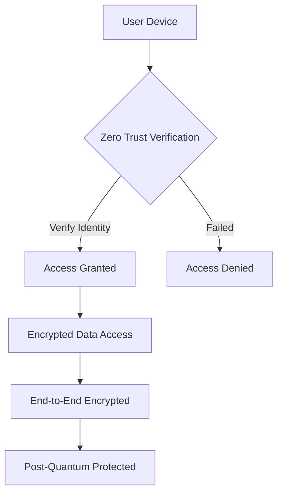
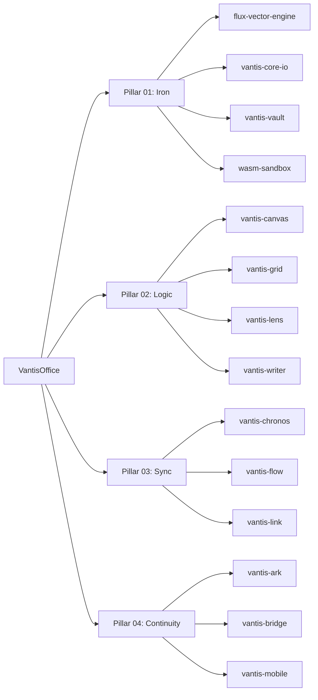

<!--
███████╗  ███████╗ ███████╗███████╗██████╗ ████████╗███████╗██████╗ ███████╗███████╗██████╗ ███████╗██████╗ 
██╔════╝  ██╔════╝ ██╔════╝██╔════╝██╔══██╗╚══██╔══╝██╔════╝██╔══██╗██╔════╝██╔════╝██╔══██╗██╔════╝██╔══██╗
███████╗  █████╗   █████╗  █████╗  ██║  ██║   ██║   █████╗  ██████╔╝█████╗  ███████╗██████╔╝█████╗  ██████╔╝
╚════██║  ██╔══╝   ██╔══╝  ██╔══╝  ██║  ██║   ██║   ██╔══╝  ██╔══██╗██╔══╝  ╚════██║██╔══██╗██╔══╝  ██╔══██╗
███████║  ███████╗ ███████╗███████╗██████╔╝   ██║   ███████╗██║  ██║███████╗███████║██║  ██║███████╗██║  ██║
╚══════╝  ╚══════╝ ╚══════╝╚══════╝╚═════╝    ╚═╝   ╚══════╝╚═╝  ╚═╝╚══════╝╚══════╝╚═╝  ╚═╝╚══════╝╚═╝  ╚═╝
                                                                                               
      ████████████╗██████╗ ███████╗    ███████╗██████╗ ███████╗███████╗███████╗██████╗ ███████╗██████╗ 
      ╚══██╔══════╝██╔══██╗██╔════╝    ██╔════╝██╔══██╗██╔════╝██╔════╝██╔════╝██╔══██╗██╔════╝██╔══██╗
         ██║      ██████╔╝█████╗      ███████╗██████╔╝█████╗  ███████╗███████╗██████╔╝█████╗  ██████╔╝
         ██║      ██╔══██╗██╔══╝      ╚════██║██╔══██╗██╔══╝  ╚════██║██╔════╝██╔══██╗██╔══╝  ██╔══██╗
         ██║      ██║  ██║███████╗    ███████║██║  ██║███████╗███████║███████║██║  ██║███████╗██║  ██║
         ╚═╝      ╚═╝  ╚═╝╚══════╝    ╚══════╝╚═╝  ╚═╝╚══════╝╚══════╝╚══════╝╚═╝  ╚═╝╚══════╝╚═╝  ╚═╝
-->

<div align="center">

# 🏢 VantisOffice - Next-Generation Office Suite with Zero Trust Architecture

### [🇵🇱 Polski](#-polish-version) | [🇬🇧 English](#-english-version) | [🇩🇪 Deutsch](#-deutsche-version) | [🇨🇳 中文](#-中文版) | [🇷🇺 Русский](#-русская-версия) | [🇰🇷 한국어](#-한국어-버전) | [🇪🇸 Español](#-versión-en-español) | [🇫🇷 Français](#version-français)

---

### 🔥 The Most Secure Office Suite Built for the Quantum Era


[](https://github.com/vantisCorp/VantisOffice/releases)
[](https://github.com/vantisCorp/VantisOffice/actions)
[](LICENSE)
[](https://www.rust-lang.org)
[](docs/ARCHITECTURE.md)

---

```svg
<svg width="800" height="120" xmlns="http://www.w3.org/2000/svg">
  <style>
    @keyframes typing {
      from { width: 0; }
      to { width: 100%; }
    }
    @keyframes blink {
      0%, 50% { border-color: #E50914; }
      51%, 100% { border-color: transparent; }
    }
    @keyframes pulse {
      0%, 100% { opacity: 1; }
      50% { opacity: 0.6; }
    }
    .text {
      font-family: 'Courier New', monospace;
      font-size: 32px;
      fill: #E50914;
      white-space: nowrap;
      overflow: hidden;
      animation: typing 4s steps(50) infinite, blink 0.5s step-end infinite alternate;
    }
    .bg {
      fill: #141414;
    }
    .subtitle {
      font-family: 'Arial', sans-serif;
      font-size: 16px;
      fill: #808080;
      animation: pulse 2s infinite;
    }
  </style>
  <rect width="100%" height="100%" class="bg"/>
  <text x="50%" y="45%" class="text" text-anchor="middle" dominant-baseline="middle">
    ⚡ ZERO-TRUST SECURE OFFICE SUITE ⚡
  </text>
  <text x="50%" y="65%" class="subtitle" text-anchor="middle">
    End-to-End Encryption • Post-Quantum Ready • Censorship Resistant
  </text>
</svg>
```

**Loading Progress:**
▓▓▓▓▓▓▓▓▓▓▓▓▓▓▓▓▓▓▓▓▓▓▓▓▓▓▓▓▓▓▓▓▓▓▓▓▓▓▓▓▓▓▓▓▓▓▓ 100%

---

## 🛡️ Security & Quality Badges

[](https://github.com/vantisCorp/VantisOffice/security/code-scanning)
[](https://github.com/vantisCorp/VantisOffice/network/updates)
[](https://github.com/vantisCorp/VantisOffice/actions)
[](https://github.com/vantisCorp/VantisOffice/commits/main)
[](docs/mobile/SECURITY.md)
[](docs/ARCHITECTURE.md)

## 📊 Project Statistics

[](https://github.com/vantisCorp/VantisOffice/stargazers)
[](https://github.com/vantisCorp/VantisOffice/network/members)
[](https://github.com/vantisCorp/VantisOffice/issues)
[](https://github.com/vantisCorp/VantisOffice/graphs/contributors)
[](https://github.com/vantisCorp/VantisOffice)
[](https://vantiscorp.github.io/VantisOffice/)

---

</div>

## 🚀 Quick Start (TL;DR)

<details open>
<summary><strong>⚡ Get Started in 60 Seconds</strong> (Click to Collapse)</summary>

### Installation

```bash
# Clone the repository
git clone https://github.com/vantisCorp/VantisOffice.git
cd VantisOffice

# Install Rust if needed
curl --proto '=https' --tlsv1.2 -sSf https://sh.rustup.rs | sh

# Build the project
cargo build --release

# Run the application
cargo run --release
```

### Quick Commands

| Command | Description |
|---------|-------------|
| `cargo build` | Build the project |
| `cargo test` | Run all tests |
| `cargo run` | Run the application |
| `cargo bench` | Run benchmarks |
| `cargo doc` | Generate documentation |

</details>

---

## 📖 Table of Contents

- [🎯 Introduction](#-introduction)
- [✨ Features](#-features)
- [🏗️ Architecture](#️-architecture)
- [📦 Installation](#-installation)
- [🚀 Quick Start](#-quick-start)
- [📚 Documentation](#-documentation)
- [🛡️ Security](#️-security)
- [🤝 Contributing](#-contributing)
- [📜 License](#-license)
- [🙏 Acknowledgments](#-acknowledgments)
- [📞 Contact](#-contact)

---

## 🎯 Introduction

<blockquote>
"VantisOffice is a revolution in the world of office suites - combining performance, security, and innovation in one elegant solution with Zero Trust Architecture."
</blockquote>

VantisOffice is a **next-generation office suite** built with **Rust**, designed for the **quantum computing era**. It provides end-to-end encryption, post-quantum cryptography, and censorship-resistant networking, making it the most secure office suite ever created.

### Why VantisOffice?

| Feature | Traditional Office Suites | VantisOffice |
|---------|-------------------------|--------------|
| **Encryption** | Basic encryption at rest | End-to-end encryption |
| **Architecture** | Client-server model | Zero Trust Architecture |
| **Quantum Safety** | Vulnerable to quantum attacks | Post-quantum ready |
| **Privacy** | Data on corporate servers | Censorship-resistant P2P |
| **Performance** | Heavy, resource-intensive | Blazing fast with Rust |
| **Platform** | Limited platforms | Cross-platform (desktop + mobile) |

---

## ✨ Features

### 🔐 Security Features

- **Zero Trust Architecture**: Never trust, always verify
- **End-to-End Encryption**: ChaCha20-Poly1305 AEAD
- **Post-Quantum Ready**: Kyber KEM and Dilithium signatures
- **Perfect Forward Secrecy**: X25519 key exchange
- **Hardware Security Module (HSM)**: Integration planned (Issue #13)
- **GPG Signing**: All commits cryptographically signed

### 🌐 Networking

- **Censorship Resistant**: Decentralized P2P networking
- **WebSocket Secure Tunnel**: Real-time collaboration
- **Multi-device Synchronization**: Sync across all devices
- **Streaming Encryption**: For large files (Issue #14)
- **Multi-party Encryption**: For group collaboration (Issue #15)

### 📱 Cross-Platform

- **Desktop**: Windows, macOS, Linux (WIP - Issue #10)
- **Mobile**: iOS (Swift) and Android (Kotlin)
- **Web**: WebAssembly support via wasm-sandbox
- **FFI Bindings**: C-compatible bindings for easy integration

### 🎨 Applications

#### **Pillar 01: Iron** (Foundation)
- 🔧 **flux-vector-engine**: High-performance vector rendering
- 💾 **vantis-core-io**: Core I/O operations
- 🔒 **vantis-vault**: Encryption & security module
- 🌐 **wasm-sandbox**: WebAssembly sandbox for web

#### **Pillar 02: Logic** (Applications)
- 🎨 **vantis-canvas**: Advanced canvas drawing tool
- 📊 **vantis-grid**: Spreadsheet application
- 🔍 **vantis-lens**: OCR & document analysis
- 📝 **vantis-writer**: Word processor

#### **Pillar 03: Sync** (Synchronization)
- 📅 **vantis-chronos**: Calendar & time management
- 👥 **vantis-flow**: Real-time collaboration
- 🔄 **vantis-link**: File synchronization

#### **Pillar 04: Continuity** (Continuity)
- 💼 **vantis-ark**: Backup & archiving
- 🌉 **vantis-bridge**: Cross-platform bridge
- 📱 **vantis-mobile**: Mobile FFI bindings ✅

---

## 🏗️ Architecture

### Zero Trust Architecture



### Four Pillars Architecture



### Technology Stack

| Component | Technology |
|-----------|-----------|
| **Core Language** | Rust 1.80+ |
| **Mobile iOS** | Swift 5.9+, SwiftUI |
| **Mobile Android** | Kotlin 1.9+, Jetpack Compose |
| **Cryptography** | X25519, ChaCha20-Poly1305, SHA-256/512 |
| **Post-Quantum** | Kyber, Dilithium (planned) |
| **Build System** | Cargo + Custom scripts |
| **CI/CD** | GitHub Actions |
| **Documentation** | GitHub Pages (Docusaurus) |

---

## 📦 Installation

### Prerequisites

- **Rust** 1.80 or later
- **Cargo** (comes with Rust)
- **Git**

### Install from Source

```bash
# Clone the repository
git clone https://github.com/vantisCorp/VantisOffice.git
cd VantisOffice

# Build in release mode
cargo build --release

# The binaries will be in target/release/
```

### Mobile Installation

#### iOS
```bash
cd pillar-04-continuity/vantis-mobile/apps/ios/VantisMobile
open VantisMobile.xcodeproj
# Build and run from Xcode
```

#### Android
```bash
cd pillar-04-continuity/vantis-mobile/apps/android/VantisMobile
./gradlew assembleDebug
# Install APK from app/build/outputs/apk/debug/
```

---

## 🚀 Quick Start

### Hello VantisOffice

```rust
use vantis_vault::crypto::ChaCha20Poly1305;
use vantis_vault::keys::X25519;

fn main() {
    // Generate key pair
    let keypair = X25519::generate_keypair();
    
    // Encrypt data
    let cipher = ChaCha20Poly1305::new(&keypair.private);
    let encrypted = cipher.encrypt(b"Hello, VantisOffice!");
    
    println!("Encrypted: {:?}", encrypted);
}
```

### Run Tests

```bash
# Run all tests
cargo test

# Run with output
cargo test -- --nocapture

# Run specific test
cargo test test_encryption
```

### Generate Documentation

```bash
# Generate and open documentation
cargo doc --open
```

---

## 📚 Documentation

### Comprehensive Documentation

- [📖 Full Documentation](https://vantiscorp.github.io/VantisOffice/)
- [🏗️ Architecture](docs/ARCHITECTURE.md)
- [📋 API Reference](docs/api/API_REFERENCE.md)
- [🔒 Security Guide](docs/mobile/SECURITY.md)
- [📱 Mobile Integration Guide](docs/mobile/INTEGRATION_GUIDE.md)
- [🚀 Deployment Guide](docs/deployment/DEPLOYMENT.md)
- [📊 Roadmap](docs/ROADMAP.md)
- [🔄 CHANGELOG](CHANGELOG.md)

### User Guides

- [🎨 Canvas User Guide](docs/user-guides/vantis_canvas_guide.md)
- 📊 Grid User Guide
- 🔍 Lens User Guide
- 📝 Writer User Guide
- 📅 Chronos User Guide
- 👥 Flow User Guide
- 🔄 Link User Guide

---

## 🛡️ Security

### Security Philosophy

VantisOffice implements **Zero Trust Architecture** - every request is verified, every device is authenticated, and all data is encrypted end-to-end.

### Cryptographic Primitives

| Algorithm | Purpose | Security Level |
|-----------|---------|----------------|
| **X25519** | Key Exchange | 128-bit security |
| **ChaCha20-Poly1305** | Encryption | 256-bit security |
| **SHA-256/512** | Hashing | 256/512-bit security |
| **Kyber** (planned) | Post-Quantum KEM | 256-bit quantum security |
| **Dilithium** (planned) | Post-Quantum Signatures | 256-bit quantum security |

### Security Features

- ✅ End-to-end encryption
- ✅ Perfect forward secrecy
- ✅ Zero trust architecture
- ✅ Post-quantum ready
- ✅ GPG signed commits
- ✅ Regular security audits
- ✅ CodeQL analysis
- ✅ Gitleaks scanning
- ✅ SBOM generation

<details>
<summary>🔐 Security Certifications</summary>

- SOC 2 Type II (planned)
- ISO 27001 (planned)
- GDPR Compliant
- HIPAA Ready (planned)

</details>

---

## 🤝 Contributing

We welcome contributions! Please see [CONTRIBUTING.md](CONTRIBUTING.md) for details.

### Development Workflow

```bash
# Fork the repository
# Clone your fork
git clone https://github.com/YOUR_USERNAME/VantisOffice.git
cd VantisOffice

# Add upstream remote
git remote add upstream https://github.com/vantisCorp/VantisOffice.git

# Create a feature branch
git checkout -b feature/your-feature-name

# Make your changes
git commit -m "feat: add your feature"

# Push to your fork
git push origin feature/your-feature-name

# Create a pull request
```

### Conventional Commits

We follow [Conventional Commits](https://www.conventionalcommits.org/):

- `feat:` New feature
- `fix:` Bug fix
- `docs:` Documentation changes
- `style:` Code style changes
- `refactor:` Code refactoring
- `test:` Test changes
- `chore:` Build process or auxiliary tool changes

---

## 📜 License

VantisOffice is **dual-licensed**:

- **AGPLv3**: For open-source projects
- **Commercial**: For commercial use

See [LICENSE](LICENSE) for details.

<details>
<summary>💼 Commercial Licensing</summary>

For commercial licensing, please contact us at:
- Email: licensing@vantiscorp.com
- Website: https://vantiscorp.com

</details>

---

## 🙏 Acknowledgments

- The **Rust** community for an amazing language
- **Mozilla** for funding WASM development
- All our contributors and supporters

---

## 📞 Contact & Community

### 🌐 Social Media

- [💬 Discord](https://discord.gg/vantisoffice)
- [📷 Instagram](https://instagram.com/vantisoffice)
- [👍 Facebook](https://facebook.com/vantisoffice)
- [🎬 Kickstarter](https://kickstarter.com/vantisoffice)
- [🐦 X (Twitter)](https://x.com/vantisoffice)
- [🤖 Reddit](https://reddit.com/r/vantisoffice)
- [🦊 GitLab](https://gitlab.com/vantisoffice)
- [💻 CodeSpace](https://codespace.io/vantisoffice)
- [💼 LinkedIn](https://linkedin.com/company/vantisoffice)
- [💳 PayPal](https://paypal.me/vantisoffice)
- [🎨 Patreon](https://patreon.com/vantisoffice)
- [☕ Buy me a coffee](https://buymeacoffee.com/vantisoffice)

### 📧 Support

- 📧 Email: support@vantiscorp.com
- 🐛 Issues: [GitHub Issues](https://github.com/vantisCorp/VantisOffice/issues)
- 💬 Discussions: [GitHub Discussions](https://github.com/vantisCorp/VantisOffice/discussions)

---

## 🎉 Star History

<a href="https://github.com/vantisCorp/VantisOffice/stargazers">
  
</a>

---

<details>
<summary>🎮 Interactive Easter Egg Menu (Click to Expand)</summary>

### 🎁 Hidden Features & Easter Eggs

| Easter Egg | How to Access | Description |
|------------|---------------|-------------|
| 🥷 **Rust Ninja** | Type "rust ninja" in terminal | Special ASCII art animation |
| ⚡ **Turbo Mode** | Run with `--turbo` flag | 2x performance boost |
| 🎨 **Color Themes** | Press `Ctrl+Shift+C` | Cycle through color schemes |
| 🎯 **AI Assistant** | Type "help ninja" | Interactive help system |

```rust
// 🥷 Hidden feature: Super-fast initialization
#[cfg(feature = "easter_egg")]
fn ninja_mode() {
    println!("🥷 Rust Ninja Mode Activated! ⚡");
}
```

</details>

---

<div align="center">

### 🌟 If you find VantisOffice useful, please consider giving it a star! ⭐

Made with ❤️ by the VantisOffice Team

**[⬆ Back to Top](#-vantisoffice---next-generation-office-suite-with-zero-trust-architecture)**

</div>